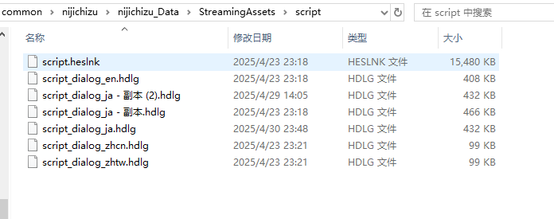
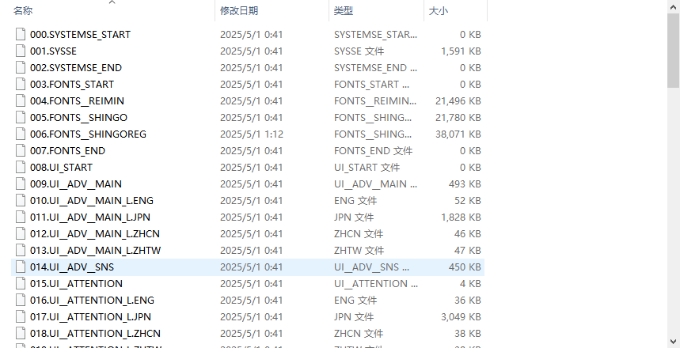
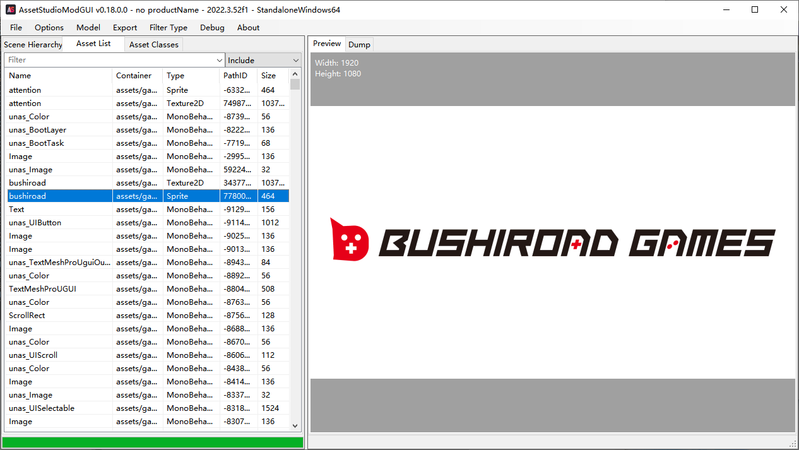
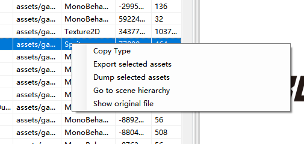
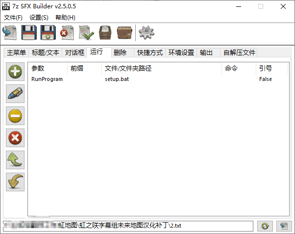
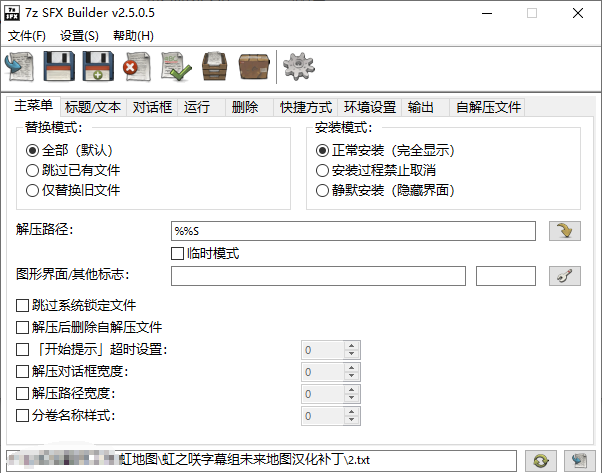

# 推荐前往[我的博客](https://blog.yediao.dpdns.org/2025/05/01/%E8%99%B9%E5%92%B2%E6%9C%AA%E6%9D%A5%E5%9C%B0%E5%9B%BE%E8%A1%A5%E4%B8%81%E5%88%B6%E4%BD%9C/)查看
完整版补丁链接https://www.nijigaku.club/nijichizu.zip

# 前言
本次汉化补丁靠的是大家的共同努力，才能在五一前完成测试并上线。
我在这次补丁的制作中主要搞的是翻译和后期打包以及测试
本文记载的是打包遇到的各种状况，为日后遇到类似问题时可以提供参考思路
github上的不是完整版补丁，仅做演示
---

# 特别感谢
在这里要特别感谢[凌空](https://github.com/LingkongSky)和[某魏](https://github.com/wlt233)两位大佬开发出的解包和打包工具以及最初的解包文件，使得字幕组可以在二月份就对文本进行汉化作业。~~***（因为一些奇奇怪怪的原因导致4月中快发售了才想起来要做图片的嵌字部分）***~~
---

# 完整解包流程
## 阶段一：解包文件
使用某魏制作的[py脚本](https://github.com/wlt233/hunex_script/tree/master/hdlg)对游戏的hdlg和hpb等文件进行解包



## 阶段二：资源提取
### 文本提取
使用[hdlg2txt.py](https://github.com/wlt233/hunex_script/blob/master/hdlg/hdlg2txt.py)
```cmd
python hdlg2txt.py script_dialog_ja.hdlg
```
可得到script_dialog_ja.hdlg.txt，里面就是游戏的日文原文文本了。
### 图形资源处理
同理，使用[hpb_unpack.py](https://github.com/wlt233/hunex_script/tree/master/hpb)处理data.hpb和data.hph
```cmd
python hpb_unpack.py data
```
得到绝大部分UI的解包文件

再使用AssetStudio查看解包出来的文件

右键提取文件就能获得UI的图片了，之后就是嵌字的活了

## 阶段三：打包补丁
### 
修改后的文件，根据文件类型不同采用不同的打包方法。不过都是用[某魏](https://github.com/wlt233)的py脚本打包
对于汉化后的文本使用txt2hdlg.py
```cmd
python txt2hdlg.py 汉化后的文本.txt
```
对于嵌字后的图片需要先写回解包文件里，
这里凌空给写了一个py脚本，但由于用的是绝对路径，而且我也在后期调试的时候修改过部分代码，逻辑比较复杂而且不具备泛用性。比起修改成相对路径还不如放个文档让ai帮忙写，那这里就不贴出我用的了。
用到的库是UnityPy，哪怕不会写代码只要把整个网页扔给GPT也能给你生成一个py脚本（）
https://github.com/K0lb3/UnityPy
以下为该库的示例
```python
import os
import UnityPy

def unpack_all_assets(source_folder: str, destination_folder: str):
    # iterate over all files in source folder
    for root, dirs, files in os.walk(source_folder):
        for file_name in files:
            # generate file_path
            file_path = os.path.join(root, file_name)
            # load that file via UnityPy.load
            env = UnityPy.load(file_path)

            # iterate over internal objects
            for obj in env.objects:
                # process specific object types
                if obj.type.name in ["Texture2D", "Sprite"]:
                    # parse the object data
                    data = obj.read()

                    # create destination path
                    dest = os.path.join(destination_folder, data.name)

                    # make sure that the extension is correct
                    # you probably only want to do so with images/textures
                    dest, ext = os.path.splitext(dest)
                    dest = dest + ".png"

                    img = data.image
                    img.save(dest)

            # alternative way which keeps the original path
            for path,obj in env.container.items():
                if obj.type.name in ["Texture2D", "Sprite"]:
                    data = obj.read()
                    # create dest based on original path
                    dest = os.path.join(destination_folder, *path.split("/"))
                    # make sure that the dir of that path exists
                    os.makedirs(os.path.dirname(dest), exist_ok = True)
                    # correct extension
                    dest, ext = os.path.splitext(dest)
                    dest = dest + ".png"
                    data.image.save(dest)
```

再使用hpb_pack_lzss.py

```cmd
python hpb_pack_lzss.py data
```
现在，补丁的文件就做好了
接下来就是替换问题了，直接做成压缩包让粉丝们解压然后替换就行了
再往下的这一步是使得粉丝们打补丁更加便利，直接做成自解压exe，可以不做，但我纯抖m，还是做了
使用的是[7z sfx builder汉化版](https://www.osssr.com/16459.html) 
然后写了一个ps1的脚本，自动查找本地的游戏exe文件和利用注册表查询steam的appId来确定游戏文件夹的位置，再自动把自解压出来的文件覆盖过去。因此，学习版和steam正版都能使用该汉化补丁。
```powershell
# 错误处理函数
function Show-Error {
    Write-Host "===========================================" -ForegroundColor Red
    Write-Host "错误：文件复制失败！" -ForegroundColor Red
    Write-Host "可能原因：" -ForegroundColor Yellow
    Write-Host "1. 游戏正在运行 → 请完全退出游戏后重试" -ForegroundColor Yellow
    Write-Host "2. 杀毒软件拦截 → 暂时关闭杀毒软件" -ForegroundColor Yellow
    Write-Host "3. 路径权限不足 → 检查文件夹权限" -ForegroundColor Yellow
    Write-Host "4. 找不到游戏or游戏未安装 → 请把补丁放入游戏根目录后再次尝试" -ForegroundColor Yellow
    Write-Host "===========================================" -ForegroundColor Red
    $null = $Host.UI.RawUI.ReadKey("NoEcho,IncludeKeyDown")
    exit 5
}

# 主程序
try {
    # 设置参数
    $appId = "3213690"
    $sourceRoot = Join-Path $PSScriptRoot "虹之咲字幕组汉化补丁"
    $global:errorOccurred = $false

    # 检测本地游戏文件
    if (Test-Path (Join-Path $PSScriptRoot "nijichizu.exe")) {
        $gamePath = $PSScriptRoot
        $found = $true
        Write-Host "[INFO] 检测到本地游戏文件，将应用补丁到当前目录：$gamePath" -ForegroundColor Cyan
    }
    else {
        # 未检测到本地文件时搜索Steam路径
        $steamPath = (Get-ItemProperty -Path "HKCU:\Software\Valve\Steam").SteamPath
        $libraryVdfPath = Join-Path "$steamPath\steamapps" "libraryfolders.vdf"

        $libraryFolders = @("$steamPath\steamapps")

        if (Test-Path $libraryVdfPath) {
            $lines = Get-Content $libraryVdfPath
            foreach ($line in $lines) {
                if ($line -match '"path"\s+"([^"]+)"') {
                    $libPath = $matches[1]
                    $libraryFolders += "$libPath\steamapps"
                }
            }
        }

        $found = $false
        foreach ($folder in $libraryFolders) {
            $manifestPath = Join-Path $folder "appmanifest_$appId.acf"
            if (Test-Path $manifestPath) {
                $content = Get-Content $manifestPath -Raw
                if ($content -match '"installdir"\s+"([^"]+)"') {
                    $installDir = $matches[1]
                    $gamePath = Join-Path $folder "common\$installDir"
                    Write-Output "检测到Steam游戏安装路径：$gamePath"
                    $found = $true
                    break
                }
            }
        }
    }

    # 如果没有找到游戏安装目录，显示错误并退出
    if (-not $found) {
        Write-Host "[ERROR] 未能找到游戏安装目录，请确认游戏已安装" -ForegroundColor Red
        Show-Error
    }
    
    # 文件复制逻辑
    if (-not (Test-Path $sourceRoot)) {
        Write-Host "[ERROR] 找不到汉化补丁文件夹" -ForegroundColor Red
        Write-Host "请把补丁放入游戏根目录后再次尝试" -ForegroundColor Red
        Write-Host "按任意键继续..."
        $null = $Host.UI.RawUI.ReadKey("NoEcho,IncludeKeyDown")
        exit 1
    }

    Get-ChildItem -Path $sourceRoot -Recurse -File | ForEach-Object {
        $relativePath = $_.FullName.Substring($sourceRoot.Length + 1)
        $targetPath = Join-Path $gamePath $relativePath
        $targetDir = Split-Path $targetPath -Parent

        if (-not (Test-Path $targetDir)) {
            New-Item -ItemType Directory -Path $targetDir -Force | Out-Null
        }

        try {
            Copy-Item -Path $_.FullName -Destination $targetPath -Force
            Write-Output "已更新：$relativePath"
        }
        catch {
            $global:errorOccurred = $true
            Write-Host "[ERROR] 更新失败：$relativePath → $($_.Exception.Message)" -ForegroundColor Red
        }
    }

    # 最终错误检查
    if ($global:errorOccurred) { Show-Error }
}
catch {
    Show-Error
}

# 成功提示
Write-Host "`n" -NoNewline
Write-Host "===========================================" -ForegroundColor Green
Write-Host " 虹组汉化补丁安装成功！按 Enter 键退出！" -ForegroundColor Green
Write-Host "           璃奈板「TOKIMEKI！！！」         " -ForegroundColor Magenta
Write-Host "===========================================" -ForegroundColor Green

# 启动游戏
$exePath = Join-Path $gamePath "nijichizu.exe"
if (Test-Path $exePath) {
    Read-Host "按 Enter 键退出补丁并清除缓存"
}
else {
    Write-Host "[WARNING] 未找到游戏主程序" -ForegroundColor Yellow
}

exit 0

```

下面做了一个bat，用来启动上面的的ps1脚本（bat的:: 注释记得上下都隔一行写，不然会有乱码的bug）
```bat
@echo off
setlocal enabledelayedexpansion

>nul reg add "HKCU\Console" /v "CodePage" /t REG_DWORD /d 65001 /f
chcp 65001 >nul
title 虹之咲字幕组未来地图汉化补丁

:: 主程序

echo ===========================================

echo 正在应用汉化补丁...
powershell -ExecutionPolicy Bypass -File "%~dp0patch.ps1"

echo ===========================================

:: 删除 patch.ps1

echo 正在删除 patch.ps1...

del /f /q "%~dp0patch.ps1"

:: 删除文件夹

echo 正在删除文件夹：虹之咲字幕组汉化补丁...

rmdir /s /q "%~dp0虹之咲字幕组汉化补丁"

:: 用 PowerShell 实现自删除

echo 正在准备自删除：setup.bat...

powershell -command "Start-Sleep -Seconds 1; Remove-Item -LiteralPath '%~f0' -Force"

exit /b

```


注意，一定要解压在自解压exe所在的路径，不然学习版就用不了了

## 阶段四：调试优化
### 奇奇怪怪的问题
- 案例1：文本超框问题 → 文本翻译是用Excel做的，能看到字数，超了就换行呗。游戏文本能用html语言来标记，换行符是`<br>`

- 案例2：特殊字符乱码 → 一般是字体导致的，换字体就行，如果有官中一般是可以直接套用官中字体的，但这块是某魏完成的，我没参与就跳过这块（单纯偷懒以及是真的不会）

- 案例3：出现了使用补丁导致CG解锁异常 → 一开始原理不明，仅为个人推测：打包方式存在问题，我们嵌字修改了12张进线的提示图，但是这12张图在包含着CG的adv.hpb里（这也是为什么最终补丁会这么大的原因，因为adv这个文件里全是CG，加起来900多M，考虑到要做完全的汉化，只能一起塞进去了）（其实里面还塞了汉化后带字幕的通关视频），于是重新打包的时候影响了原来的CG的某个序号，导致和保存在system.dat里的数据不一致，当使用回忆查看时，就会导致CG读取错乱（后来在某魏的帮助下证明了确实是有这个bug，并且已经修复了打包方式）这里再赘述一点点，某魏的打包工具是从原先的三位数序号改成四位数，因为正式版变成了2600个文件。如果以后有人遇到了五位数的序号，可能要自己改改工具的代码了（

- 案例4：非Windows用户想用怎么办 → 你都能用其他系统运行官方游戏exe了，就直接运行自解压exe、把解压出来的文件夹手动复制进游戏文件夹呗
---

## 成品展示


---

## 心得体会
~~又不是写报告哪来的这玩意~~
还是很有意思的，至少知道补丁是咋做的，虽然了解到的比较片面就是了。

又是专业不对口的一集

---

## Q&A
<!-- 预留常见问题解答区 -->
常见问题暂时想不到，先保留吧
